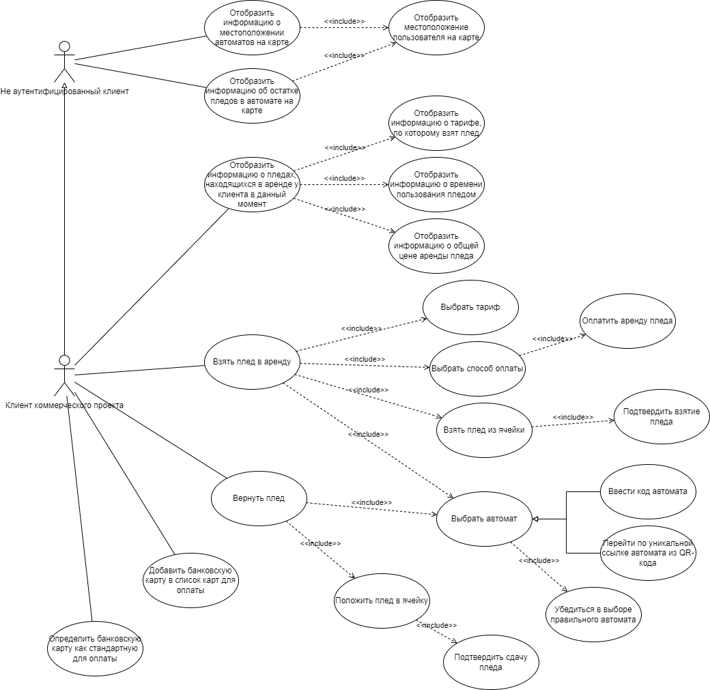
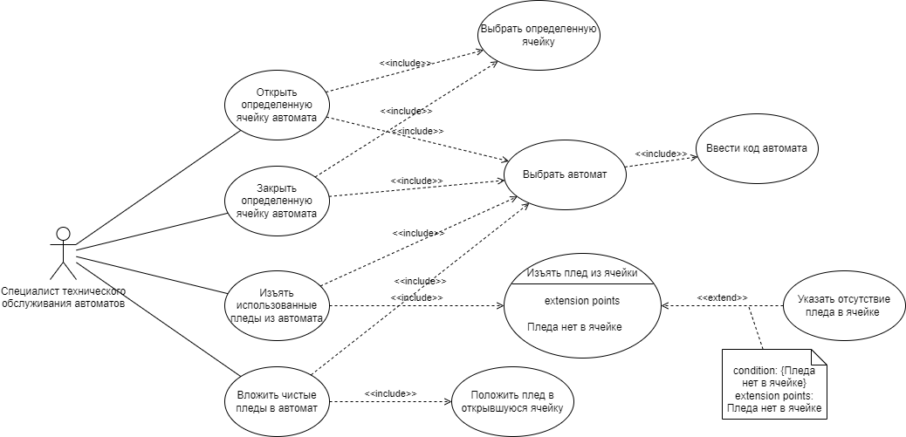
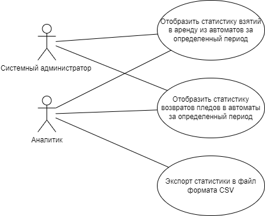

---
csl: gost-r-7-0-5-2008-numeric-iaa.csl
bibliography: demo.bib
...

# Формирование требований к системе на основе анализа предметной области

Формирование требований к системе -- важная часть работы над любым программным продуктом, поэтому в данной главе будут рассмотрены: 

- анализ структуры предприятия заказчика, 
- анализ проблем, которые испытывает заказчик, 
- финансовое обоснование реализации системы,
- анализ конкурирующих решений,
- методы решения поставленной проблемы,
- ожидания пользователей от системы,
- границы реализуемой системы.

Итогом анализа станет проведение функционально-стоимостного анализа, по результатам которого будут сформированы оптимальные функциональные и нефункциональные требования к системе. 

## Обоснование реализации системы {#sec:obosn}

В ходе рассмотрения целесообразности реализации программной системы следует начать с рассмотрения заказчика. Система разрабатывается в интересах ООО "ГЭТ Э БЛАНКЕТ". Данная компания основана студентами НИУ ВШЭ и фактически представляет собой "студенческий стартап", что позволяет компании участвовать в программах государственных грантов. Цель компании -- реализация системы шеринга (краткосрочной аренды) пледов как продукта для повседневного пользования. На февраль 2024 года над проектом работают 7 человек из Перми и Москвы. Финансирование компании осуществляется за счёт государственного гранта Фонда Содействия Инновациям "Студенческий стартап". 

Исходя из вышесказанного, компания занимается арендой пледов, для реализации этого требуются точки продаж, компания хотела бы размещать их в парках и на улицах городов. Но размещение классических точек продаж стоит слишком дорого, по мнению генерального директора Атаевой Сабины Валерьевны, так как только средняя зарплата продавца в Москве от 70 до 100 тысяч рублей в месяц, без учета дополнительных сборов [@BDEX-zp-prod;@gorodrabot-zp-prod]. Поэтому компания нацелена на снижение расходов на размещение точек, что привело к идее размещения пледов в вендинговых аппаратах. 

Для доказательства востребованности продукта, компанией было проведено исследование рынка, которое показало, что потенциальный размер рынка достаточный для реализации проекта, а при высокой востребованности продукта, что позволит привлечь венчурные инвестиции. Предполагаемые общий объем целевого рынка (_TAM_) составляет 20 млрд рублей в год, доступный объем обслуживаемого рынка (_SAM_) составляет 2 млрд рублей в год, достижимый объем рынка (_SOM_) за последующие 7 лет с учетом дополнительных инвестиций 1 млрд рублей в год.

Исходя из построенной бизнес модели (см. приложение [-@sec:finmodel]) рентабельность бизнеса составит 50% в сезон или 25% в год, что оправдывает риски создания нового бизнеса. Также использование уникальной бизнес-модели позволяет претендовать на грантовое финансирование, а также позволяет привлекать венчурный капитал. На данный момент компания существует на средства выделенные грантом Фонда Содействия Инновациям "Студенческий стартап", на данный момент грант получен в полном объеме (1 млн рублей).

Из вышесказанного можно сделать вывод, что реализация бизнес-модели стартапа без использования автоматизированной цифровой программно-аппаратной системы учета аренды нецелесообразна, так как услуга предоставляемая по такой бизнес-модели стоила бы слишком дорого, что значительно уменьшило бы спрос, и сделало бы компанию убыточной. 

Таким образом бизнес процесс, который хотел бы иметь заказчик: клиент пользуясь своим телефоном, берет плед в аренду, получая его через вендинговый аппарат, оплата должна производиться ежечасно или посуточно, возвращение пледа происходит аналогичным образом в любой из вендинговых аппаратов компании; система должна иметь возможность обсечения контроля за обслуживанием автомата: выкладки чистых и сбора грязных пледов. Более подробно бизнес процесс TO BE описан на диаграмме ландшафта (см. рисунок [-@fig:landscape]).

{#fig:landscape}

Для реализации данного бизнес процесса требуется программно-аппаратная система, поэтому далее будут рассмотрены конкурирующие системы учёта вендинговых аппаратов.

## Сравнительный анализ существующих систем 

В ходе анализа рынка не было обнаружено систем, которые могли бы в полной мере реализовать бизнес процесс заказчика, поэтому главным критерием возможности применения рассматриваемых конкурирующих систем является возможность адоптации системы под рассматриваемый бизнес процесс.

Далее будут рассмотрены системы компаний: 

- OTI Global -- международная компания, специализирующаяся на разработке систем бесконтактных платежей в том числе с использованием вендинговых технологий [@otiglobal];
- Cantaloupe -- международная компания специализирующаяся на система управления IoT в сфере торговли [@cantaloupe];
- Новософт -- российская компания, специализирующаяся на консалтинге в сфере интеграции программного обеспечения и IT-технологий в существующий бизнес партнеров [@novosoft];
- Hubex -- российская компания, разработчик одноименной системы управления персоналом и обслуживания [@hubex];
- ZetaSoft -- российская компания, специализирующаяся на разработке систем управления и обслуживания в сферах автомобильного и вендингового бизнеса [@zetasoft].

Далее будут рассмотрены особенности систем каждой из компаний.

OTI Global предлагает комплексную программно-аппаратную систему "OtiMetry System", включающую в себя программное обеспечение учета продаж, контроллеры и терминалы NFC. Данная система позволяет гибко настроить систему оплаты, берет обеспечение автомата связью с интернетом на себя, имеет документированное API, позволяющее интегрировать ее в общую систему. Но данная система не может обеспечить отслеживание возвратов пледов, а также не имеет возможности почасовой оплаты [@otiglobal]. 

Компания Cantaloupe предлагает программно-аппаратную систему "Self-service Kiosks", представляющую собой интеграцию кассы самообслуживания в вендинговые технологии. Данная система позволяет интегрировать внешние системы оплаты, обеспечивает отслеживание продажи и аренды, но не включает в себя системы обеспечения обслуживания, а также требует закупки дорогостоящего оборудования для работы (касс самообслуживания) [@cantaloupe].

Продуктом компании Новософт является "NERPA EAM BOX", данная система предоставляет функции комплексной автоматизации обслуживания автоматов. Преимуществами продукта являются возможность учета выездного обслуживания, наличие внутренней системы управления персоналом, формирование отчетной документации по требованиям установленным на территории РФ. Недостатком является невозможность отслеживания аренды и интеграции платежных систем с почасовой оплатой [@novosoft].

Компания Hubex является разработчиком одноименного продукта, представляющего собой единую систему отслеживания процессов компаний ориентированных на предоставление услуг в различных сферах. Преимуществами данной системы являются встроенная гибкая система управления персоналом. Недостатками являются отсутствие системы отслеживания аренды, направленность системы на обслуживание автомата, в связи с чем отсутствие системы оплаты покупок [@hubex].

Продукт Zeta Вендинг предоставляет возможности автоматизации работы компаний в сфере вендингового бизнеса. Система предоставляет возможности гибкого планирования обслуживания автоматов, автоматическое отслеживание продаж и составление на их основе планов обслуживания, создание отчетов по продажам, возможность интегрирования систем оплаты. Недостатками являются отсутствие систем отслеживания аренды, отсутствие систем взаимодействия с клиентом [@cantaloupe].

Для более наглядного сравнения конкурентов была построена сводная таблица [-@tbl:competitors].

| Критерий | OTI Global | Cantaloupe | Новософт | Hubex | ZetaSoft |
|:---|:---:|:---:|:---:|:---:|:---:|
| Отслеживание покупок | + | + | + | + | + |
| Возможность интеграции внешней системы оплаты | - | + | - | - | + |
| Возможность отслеживания аренды | - | - | - | - | - |
| Система обслуживания автоматов | - | - | + | + | + |
| Возможность интеграции внешней системы обслуживания автоматов | + | - | - | - | - |
| Система управления персоналом | - | - | + | + | + |
| Возможность организации сбора грязных и выкладки чистых пледов | - | - | - | + | + |
| Возможность почасовой оплаты | - | - | - | - | - |
| Наличие системы обслуживания клиентов | + | + | - | - | - |
| Возможность интеграции внешней системы обслуживания клиентов | + | - | - | - | - |

Table: Сравнение конкурентов по критериям {#tbl:competitors}

Исходя из сказанного выше можно сделать вывод, что существующие системы не могут выполнять бизнес процесс заказчика, так как ни одна из систем не дает возможности отслеживания аренды и возможностей почасовой оплаты. 

## Методы решения поставленной проблемы 

Использование вендинговых технологий распространено на многие сферы, поэтому логично изучить научные работы на тему применения шеринговых и вендинговых технологий, а также применение технологий в сфере интернета вещей. 

В ходе анализа были обнаружены научные работы исследовавшие темы смежные к теме данной работы. В основном работы на данные темы связаны с финансированием и инвестированием в вендинговые технологии [@invest-vend;@buisnes-vend;@laryok2;@vend-torg-russia;@kak-zarabotat-na-vendingovyh;@biznes-na-vendingovih] из чего можно сделать вывод, что программное обеспечение вендиговых аппаратов с научной точки зрения рассмотрено слабо. Работ по использованию вендинга для аренды не было найдено в открытом доступе, но существуют работы, описывающих использование шеринговых технологий в IT-бизнесе [@sharing-control]. 

Также хорошо представлены работы описывающие использование облачных технологий и IoT [@model-alg-architecture;@instrumenty-architecture;@role-architecture]. В этих работах чаще рассматривается теоретическая архитектура решения, при этом физическая реализация этой архитектуры как правило не рассматривается. Практическое применение современных архитектурных паттернов представлено в работах [@microservice-monolithic-architecture;@development-authentication].

### Современное использование вендинговых технологий  

Торговые автоматы стали популярны во второй половине 20-го века. В то время в СССР использовались автоматы по продаже напитков и газет [@goldman]. Технологии автоматической торговли широко используются во многих отраслях промышленности. В настоящее время существует большое количество различных типов торговых автоматов, как специализированных для определенных целей, таких как автоматы компании "БериЗаряд", для аренды внешних аккумуляторов (повербанков), так и универсальных. Классификацию по типу использования можно увидеть на рисунке [-@fig:vendingTypes].

![Классификация вендинговых аппаратов по типу использования [@gruber]](vending_types.png){#fig:vendingTypes}

Основываясь на информации, представленной в статьях "The Commodity Vending Machine" [@gruber] и "Design of a High-Tech Vending Machine" [@sibanda], можно сделать некоторые выводы о существовании различных типов торговых автоматов, используемых сейчас. Кроме того, можно сделать вывод, что в настоящее время использование торговых автоматов вышло за рамки торговли и распространилось на такие сферы, как производственный учет, развлечения, парковка и другие.

В соответствии с "Design of a High-Tech Vending Machine" [@sibanda], более подробно рассматриваются концепции, связанные с системами распределения торговых автоматов. Оценка этих систем осуществляется с помощью матрицы решений, при этом для этой цели используются такие критерии, как скорость доставки продукта, долговечность использования устройства, надежность и производительность.

Эти идеи полностью реализуются за счет использования модулей, облегчающих общение с мобильными устройствами через Интернет. Применение технологий Интернета вещей расширяет потенциал приложений для торговых автоматов, поскольку позволяет собирать данные для анализа и обработки с целью выявления различных зависимостей, включая предпочтения пользователей и спрос на торговые услуги в определенное время суток. Это также позволяет в режиме реального времени отслеживать состояние торгового автомата и получать уведомления о необходимости пополнения запасов, ремонта и технического обслуживания.
  
В статье "New Generation Artificial Intelligent Vending Machine System based on LoRaWan IOT Network" [@hsu] описывается реализация этих систем и исследуется потенциал использования искусственного интеллекта (_Artificial Intelligence_) для определения предпочтений пользователей.

### Современные подходы к проектированию программных систем {#sec:arch}

Чтобы определить оптимальный архитектурный дизайн для будущей системы, необходимо провести анализ научных достижений в области проектирования программных систем, использующих технологии Интернета вещей (_IoT_). Для классификации архитектуры систем, многие исследователи разделили проекты на различные абстрактные уровни. Как следствие, для каждого уровня абстракции были созданы различные шаблоны проектирования. Согласно статье "Landscape of Architecture and Design Patterns for IoT Systems" [@washizaki], были рассмотрены три уровня абстрактности: высокий уровень абстракции, средний уровень абстракции и низкий уровень абстракции.

Чтобы определить возможные архитектурные решения, которые могли бы обеспечить бесперебойную работу системы, исследователи часто критикуют использование монолитных архитектур в пользу микроядерных и микросервисных архитектур [@motta].

Рассматривая шаблоны проектирования наиболее часто используемых приложений, которые в настоящее время используют взаимодействие клиент-сервер, мы можем сделать вывод, что многие системы, которые в настоящее время находятся в стадии разработки, используют архитектуру микросервисов. По мнению авторов статьи "The Comparison of Microservice and Monolithic Architecture" [@gos], многие системы, которые изначально разрабатывались как монолитные, в процессе развития часто используют шаблоны микросервисов в процессе длительной разработки. Авторы утверждают, что архитектуры таких систем следует называть микроядерными.

Согласно статье "Development Authentication and Authorization Systems of Multi Information Systems Based REst API and Auth Token" [@anugrah] на данный момент наиболее простым и масштабируемым архитектурным подходом является микросервисный.

### Перспективное развитие систем совместного использования

Рассматривая тему технологий совместного использования, большинство статей посвящено экономическим показателям систем шеринга и применению такой бизнес-модели [@grybaite]. Обсуждаются потенциальные перспективы развития общества за счет использования общих предметов домашнего обихода, а также общие экономические выгоды от развития бизнеса в области технологий совместного использования [@davlembayeva].

Что касается реализации совместно используемых систем, авторы ссылаются на общие шаблоны проектирования систем Интернета вещей (_IoT_). Обращается внимание на необходимость дальнейшего развития технологий мобильной связи, таких как 5G и 6G, которые в настоящее время активно разрабатываются [@ahmad]. В статье "Vision, Requirements, and Technology Trend of 6G: How to Tackle the Challenges of System Coverage, Capacity, User Data-Rate and Movement Speed" [@chen] отмечается постоянное увеличение объема информации, передаваемой через мобильные сети, что приводит к перегрузке сети это существенно влияет на качество шеринговых систем.

## Формирование требований к системе 

В рамках формирования требований к системе требуется определить функциональные и нефункциональные требования, а также рамки разрабатываемой системы. Для этого было проведено 2 глубинных интервью с заказчиком, а также функционально-стоимостной анализ (см. приложение [-@sec:FSA]).

<!-- TODO Расписать больше про ФСА -->

### Функциональные требования 

После проведения интервью с заказчиком была поставлена цель реализуемой системы: сделать возможной автоматизированную краткосрочную аренду пледов (шеринга) через вендинговые аппараты, установленные на улицах и в парках города. Для этого необходимо: 

- иметь возможность автономно сдать в аренду и вернуть плед,
- иметь возможность проводить обслуживание автоматов,
- иметь возможность собирать диагностические и иные данные с автоматов.

После проведение дополнительного интервью были поставлены задачи, которые должна выполнять система: 

- обеспечить автономную и автоматическую аренду пледов через вендинговые автоматы:
    - обеспечить возможность взымания платы с клиентов,
    - обеспечить возможность взятия пледа из автомата,
    - обеспечить возможность возврата пледа в автомат,
    - обеспечить отслеживание пледов находящихся в аренде,
    - обеспечить возможность нахождения ближайшего к клиенту автомата;

- обеспечить возможность технического обслуживания автоматов: 
    - обеспечить возможность открытия ячейки автомата,
    - обеспечить возможность изъятия грязных пледов из автомата, 
    - обеспечить возможность выкладывания чистых пледов в автомат;

- обеспечить возможность мониторинга: 
    - обеспечить возможность просмотра графиков количества взятий пледов в аренду из автомата,
    - обеспечить возможность просмотра графиков количества возвратов пледов из аренды в автомат;

Исходя из задач посаленных заказчиком и изучения структуры компании, описанной в пункте [-@sec:obosn], были выявлены следующие типы пользователей: 

Клиенты коммерческого проекта -- люди, гуляющие вечерами, когда на улице начинает холодать, а форма одежды была выбрана на более теплое время суток.

Специалисты технического обслуживания автоматов -- специалисты, задачами которых является поддержка рабочего состояния автоматов и выкладка/сбор пледов.

Системные администраторы -- специалисты, занимающиеся поддержкой работы программно-аппаратного комплекса.

Аналитики -- специалисты, занимающиеся анализом статистики взятий и возвратов пледов за определенный период.

Для того, чтобы формализовать требования к системе из желаний заказчика были построены UML представленные на рисунках [-@fig:umlUseCaseClients], [-@fig:umlUseCaseTechnical], [-@fig:umlUseCaseAnalytics].

{#fig:umlUseCaseClients height=24.5cm}

{#fig:umlUseCaseTechnical height=24.5cm}

{#fig:umlUseCaseAnalytics height=8cm}

Далее представлены требования пользователей-клиентов коммерческого проекта: 

- Система должна отображать номер ячейки автомата при взаимодействии клиента с ней.

- Система должна отображать карту с указанием местоположения автоматов и пользователя.

- Система должна отображать информацию о количестве доступных пледов в автоматах на карте.

- Система должна отображать информацию о пледах, находящихся в аренде пользователем на данный момент, а именно тариф, время пользования, общая цена аренды.

- Система должна отображать данные пользователя (номер телефона) на основной странице.

- Система должна позволять добавлять банковскую карту для оплаты с основной страницы.

- Система должна позволять указывать основную банковскую карту для оплаты.

- Пользователь должен иметь возможность выбрать автомат посредством ввода уникального кода автомата.

- Система должна предоставлять возможность выбора автомата посредством перехода по уникальной ссылке.

- Пользователь должен иметь возможность взять в аренду до 5 пледов. 

- Система должна предоставлять возможность закрытия ячейки по указанию пользователя.

- Система должна предоставлять фотографии автомата.

- Система должна отображать список возможных тарифов для аренды пледа.

- Система должна позволять выбрать один из возможных тарифов для аренды пледа.

- Система должна позволять выбрать основную банковскую карту до оплаты тарифа.

Далее представлены требования пользователей-специалистов технического обслуживания автоматов:

- Система должна отображать номер ячейки автомата при взаимодействии специалиста с ней.

- Система должна позволять выбирать автомат один раз для выполнения нескольких операций.

- Система должна организовать изъятие использованных пледов из автомата.

- Система должна позволять отмечать отсутствие пледа в ячейке (данное действие требует подтверждения).

- Система должна организовать выкладывание чистых пледов в автомат. 

- Система должна позволять открывать определенную ячейку автомата.

- Система должна позволять закрывать определенную ячейку автомата.

Далее представлены требования пользователей-аналитиков и пользователей- системных администраторов:

- Система должна отображать графики по количеству взятий пледов в аренду из определенного автомата за определенный период.

- Система должна отображать графики по количеству возвратов пледов в определенный автомат за определенный период.

- Система должна иметь возможность экспортировать данные в формате CSV.

### Нефункциональные требования 

Исходя из требований заказчика были сформулированы следующие требования: 

- Система должна позволять блокировать доступ к определенной ячейке автомата, так как требуется иметь возможность отключать сломанные ячейки автомата.

- Система должна проводить авторизацию специалистов технического обслуживания, аналитиков, системных администраторов для обеспечения информационной безопасности.

- Система должна идентифицировать пользователя с помощью номера телефона.

- Система должна подтвердить, что номер телефона пользователя принадлежит ему.

- Открытие ячейки должно происходить не позднее, чем через 1 секунду после оплаты.

- Система должна позволять устанавливать таймеры для операций взятия и сдачи пледа, которые не будут считаться в время аренды.

- Авторизация персонала должна производиться посредством протокола _LDAP_, для обеспечения совместимости с системой учёта персонала.

Также в ходе анализа предметной области были выявлены нормативные акты регулирующие сферы деятельности затрагиваемые рассматриваемой системой. Таким образом, система должна соответствовать федеральным законам РФ: № 152-ФЗ “О персональных данных”, № 395-1 ”О банках и банковской деятельности”, № 115-ФЗ “О противодействии легализации (отмыванию) доходов, полученных преступным путем, и финансированию терроризма”.

### Рамки реализации программной системы 

Общие рамки реализации системы имеют следующие границы: 

- Функциональные границы: автоматизация процесса аренды пледов.

- Географические границы: вендинговые аппараты, выдающие и принимающие пледы. Аппараты находятся в парках города Москва. Автоматы берутся в аренду с ПО от производителя, далее это ПО может быть модифицировано или заменено. Разрабатываемое ПО подключается к арендуемому автомату. Тестирование будет производиться в зависимости от того, удастся ли получить экземпляр вендингового аппарата. Если не удастся, то тестирование будет производиться посредством моделирования реального поведения вендингового автомата. В случае, если вендинговый аппарат получить удастся, то тестирование будет производиться непосредственно на нем.  Второй вариант наиболее благоприятен, так как показывает результат test case в реальных условиях. 

- Организационные границы: техник обслуживания(забирает/раскладывает пледы по аппаратам, техническое обслуживание), посетители парков. 

## Выводы по главе 

В данной главе приведен анализ предметной области, приведены обоснования разработки и анализ конкурентов, формализованы требования заказчика: 

1. Рассмотрена бизнес-модель заказчика, установлен бизнес процесс требующий автоматизации, сделан вывод о необходимости реализации программной системы.
1. Рассмотрены конкурирующие решения, сделаны выводы о слабых и сильных сторонах конкурентов, выявлены их слабости не позволяющие использование их для реализации автоматизации бизнес процесса.
1. Рассмотрены научные статьи относящиеся к предмету исследования.
1. Рассмотрены существующие методы решения проблемы автоматизации бизнес процесса.
1. Формализованы функциональные и нефункциональные требования, а также установлены рамки реализации программной системы.

Итогом первой главы является техническое задание, утвержденное заказчиком ООО "ГЭТ Э БЛАНКЕТ", написанное в соответствии с ГОСТ 19.201-78 [@gostTZ], представленное в приложении [-@sec:TZ].

# Проектирование и формализация архитектуры программного решения

После формализации требований к системе, определения бизнес процессов и условий эксплуатации системы возможно приступить к проектированию системы. В рамках первой главы были рассмотрены существующие научные работы, был проведен функционально-стоимостной анализ, что окажет значительное влияние на формирование архитектурного облика системы. 

В рамках этой главы следует: 

- определить и обосновать выбор архитектурного дизайна системы, провести сравнительный анализ рассматриваемых архитектурных паттернов;
- распределить бизнес процессы на компоненты системы в соответствии с выбранным архитектурным дизайном и средствами разработки;
- определить и обосновать выбор средств разработки системы, провести общее проектирование компонентов системы, включая проектирование интерфейсов;
- распределить задачи реализации отдельных компонентов системы на команду разработчиков, определить методы управления командой разработки;
- выполнить полное проектирование компонентов системы рассматриваемых в рамках данной работы.

Итогом данной главы станет:

- формализованная архитектура всей системы описанная в соответствии с нотацией "C4 model";
- макеты интерфейсов системы;
- диаграмма физической модели базы данных в сошествии с нотацией UML;
- полное описание архитектуры компонентов, разработка которых рассматривается в рамках данной работы.

Для проектирования и формализации архитектуры были выбраны следующие средства: 

- графический редактор Draw.io для построения диаграмм, был выбран по причинам: возможность проектирования с использованием шаблонов UML и C4, возможность совместного редактирования, все члены команды имеют опыт пользования данным программным продуктом, полностью бесплатен;

- графический редактор Figma для построения макетов интерфейсов, так как предоставляет возможности представления макетов визуального облика системы как демо приложение, что позволяет аналитикам проводить тестирование интерфейса на фокус-группе; данный редактор позволяет гибко настраивать взаимодействия компонентов макета между собой, что в значительной степени упрощает реализацию макетов виде кода.

## Выбор архитектурного дизайна системы 

Рассматривая научные работы в пункте [-@sec:arch] были выделены несколько научных работ, рассматривающих различные виды архитектурного дизайна с использованием технологии Интернета вещей. Во множестве работ выражался скепсис по отношению к использованию монолитной архитектуры [@washizaki; @motta; @gos]. В качестве аргументов приводились: малая возможность к масштабированию, сложность организации распределенных вычислений, низкая по отношению к распределенным архитектурам отказоустойчивость. Поэтому было принято решение использовать микросервисную архитектуру в качестве базового архитектурного дизайна.

Таким образом, далее следует определить архитектурный стиль, которого следует придерживаться в ходе разработки. Архитектурные стили — это высокоуровневые стратегии, которые представляют собой абстрактную структуру для систем [@arch-style]. Рассмотрим некоторые из них: 

1. Многослойный. Типичный пример — многоуровневый стиль из 3 слоёв: слой представления, бизнес-логика и хранение данных. Плюсы: лёгкий в понимании, тестировании и поддержке. Минус: появление накладных расходов на производительность. Данный стиль требует создания монолитной клиент-серверной архитектуры, поэтому не является предпочтительным.

1. Компонентно-ориентированный. Разделяет функциональность на слои в рамках одной системы, организованной как повторно используемые и слабосвязанные компоненты. Плюсы: гибкость, поддерживаемость, повторное использование. Минус: сложность управления компонентами. Данный стиль требует создания множества универсальных библиотек, что делает его неподходящим для создания легковесных контейнеров, что может потребовать увеличения потребных вычислительных мощностей. Также данный стиль сложен для восприятия программистом, что может создать значительные сложности в рамках разработки начинающими специалистами. По этим причинам данный архитектурный стиль не является приемлемым.

1. Сервисно-ориентированный. Требует разработки ПО как набора взаимодействующих сервисов через сеть. Плюсы: слабая связанность, гибкость и возможность быстрого масштабирования. Минусы: сложность развёртывания, сетевая зависимость. Данный стиль требует разработки отдельных компонентов системы, как отдельных контейнеров, что требует разработки каждого компонента, фактически как отдельной системы, что приемлемо в рамках разработки командой. Сложность развёртывания нивелируется наличием в команде специалиста по поддержке и развёртыванию систем. Данный стиль можно считать приоритетным.

1. Распределённая система. Компоненты на сетевых компьютерах передают сообщения для взаимодействия и координирования действий, чтобы достичь цели. Плюсы: общий доступ, устойчивость к ошибкам и сбоям, возможность масштабирования. Минусы: сложность, сетевая зависимость. Данная архитектура потребовала бы размещения всех компонентов системы на каждом автомате, что усложняет масштабируемость системы, усложняет взаимодействие между автоматами, а также несет риски связанные с качеством сетевого соединения автоматов, поэтому данный архитектурный стиль не является приоритетным.

1. Предметно-ориентированный. Создаёт программные абстракции (модели предметных областей). Плюсы: ограниченные связи, целостность и взаимосвязь. Минусы: требует глубокого понимания и опыта в рассматриваемой области. Данный архитектурный стиль требует глубокого понимания предметной области, но так как в команде отсутствует специалист по продажам и аренде с использованием вендинговых и шеринговых технологий, а также специалистов реализации систем с использованием паттернов технологий Интернета вещей, данный стиль нельзя считать приоритетным, но можно считать приемлемым.

Исходя из анализа можно сделать вывод, что наиболее подходящей станет сервисно-ориентированная микросервисная архитектура, так как, исходя из критериев требований описанных в техническом задании (см. приложение [-@sec:TZ]), система должна обладать свойствами: способность к масштабированию, гибкость вносимых изменений, стоимость поддержки и развития, защита от внешнего вмешательства.

На основе выбранного дизайна была покроена упрощенная модель архитектуры, представленная на рисунке [-@fig:simple-arch], построенная на основе бизнес-процессов описанных на Use Case диаграммах (см. рисунки [-@fig:umlUseCaseClients], [-@fig:umlUseCaseTechnical], [-@fig:umlUseCaseAnalytics]).

{#fig:simple-arch}

## Определение общей архитектуры системы и выбор средств разработки 

Рассматривая средства разработки их следует делить на два типа: средства написания кода и взаимодействия команды, а также программные средства реализации системы (_SDK_). В данной части будут рассмотрены именно средства реализации.Средства написания кода, выбирались каждым участником команды индивидуально и будут рассмотрены в рамках 3 главы, средства взаимодействия команды будут рассмотрены отдельно в пункте [-@sec:team-management].

Для построения диаграмм архитектуры системы была выбрана нотация C4. Для построения общей модели системы далее будет проведен анализ каждого компонента системы до второго уровня нотации (модели контейнеров).

На рисунке [-@fig:context] представлена диаграмма контекста (диаграмма первого уровня по нотации С4). 

{#fig:context}

В ходе анализа бизнес процессов были выделены основные компоненты системы, представляющие собой микросервисы, которые требуют взаимодействия с друг-другом, но выполняют задачи независимо. Из диаграммы видно, что система имеет связи с внешними системами "Сервис банка-партнера" и "Сервис подтверждения номера".

Далее рассмотрим каждый микросервис в отдельности для более глубоко понимания взаимодействия контекстов.

Первыми следует рассмотреть контейнеры Ядра системы (см. рисунок [-@fig:containers-core]), так как это связующее звено системы. Данный микросервис отвечает за отслеживание аренды, передачу задач на другие микросервисы, благодаря наличию данного микросервиса архитектуру можно назвать микроядерной. Данный микросервис состоит из API Server, СУБД общего назначения и Защищенной СУБД. Основная часть микросервиса ("API Server") будет разработана с использованием библиотек ASP.NET Core, Entity Framework Core для языка C#, так как с этими технологиями знакомы все разработчики, при этом оно обеспечивает достаточную производительность. Использование данного стека позволяет автоматически генерировать документацию в соответствии с OpenAPI, что упростит документирование и взаимодействие разработчиков разных микросервисов системы. Для реализации базы данных будет использовано СУБД PostgreSQL, так как данная СУБД распространяется бесплатно по свободной лицензии, а также у разработчиком есть опыт работы с ней. Для реализации "СУБД временных рядов" была выбрана база данных InfluxDB, так как данная база данных имеет гибкую настройку автоматического удаления устаревших данных, а также к данной СУБД возможно подключение программного решения "Grafana", позволяющего выполнять все задачи аналитика (см. рисунок [-@fig:umlUseCaseAnalytics]). Реализация отдельной базы данных для персональных данных обусловлена законодательством РФ, которое обязывает хранить персональные данные на серверах, имеющих дополнительные степени защиты, из-за чего их использование обходится дороже, поэтому было принято решение вынести базу персональных данных на отдельный сервер. Реализация -- СУБД PostgreSQL Pro входящая в перечень российского ПО.

{#fig:containers-core}

Микросервис "Пользовательский интерфейс" состоит из двух контейнеров "Интерфейс системы" и "Веб сервер" (см. рисунок [-@fig:containers-client]). Для реализации "Интерфейс системы" выбрано программное решение на основе библиотеки Flutter на языке Dart. Это решение обосновано тем, что данный фреймворк позволяет компилировать приложение под платформы: Web, Android, iOS. Это значительно сокращает потенциальные трудозатраты на разработку отдельных приложений под каждую платформу. Для реализации "Веб сервер" выбрано программное решение nginx, так как данное решение имеет возможность полного проксирования запросов на другую машину и разработчики уже имеют опыт его использования.

{#fig:containers-client height=9.5cm}

Сервис аутентификации ответственен за выдачу JWT-токенов для интерфейса системы входящего в состав микросервиса "Пользовательский интерфейс", также он осуществляет взаимодействие с внешней системой "Сервис подтверждения номера" (см. рисунок [-@fig:containers-auth]). Основная часть модуля ("API Server") будет представлена в виде RESTful API и разработана с использованием библиотек ASP.NET Core, Entity Framework Core для языка C#, по причинам описанным ранее. Для реализации "СУБД сервиса аутентификации" будет использовано СУБД PostgreSQL.

{#fig:containers-auth}

Банковский сервис ответственен за отслеживание и проведение банковских операций, сохранение и агрегирование информации о способах оплаты пользователей, также он осуществляет взаимодействие с внешней системой "Сервис банка-партнера" (см. рисунок [-@fig:containers-bank]). Основная часть модуля ("API Server") будет представлена в виде RESTful API и разработана с использованием библиотек ASP.NET Core, Entity Framework Core для языка C#, по причинам описанным ранее. Для реализации "СУБД банковского сервиса" будет использовано СУБД PostgreSQL.

{#fig:containers-bank}

Технический сервис ответственен за техническое обеспечение работы бизнес-модели, включает в себя управление функциями выкладки и сбора пледов и другими задачами технического обслуживания (см. рисунки [-@fig:umlUseCaseTechnical], [-@fig:umlUseCaseAnalytics]). Модель контеинеров представлена на рисунке [-@fig:containers-tech]. Для реализации клиентской части (контейнер "Интерфейс системы") будет использован язык TypeScript благодаря его статической типизации, что позволит избежать многих ошибок компиляции и позволит более четко определять структуры данных. В качестве целевого фреймворка будет использован React, так как разработчик имеет широкий опыт использования данного фреймворка, написание на фреймворке специально разработанном для написания веб-приложений ускоряет разработку и быстродействие итоговой системы (в сравнении с Flutter), а невозможность компиляции данного контейнера в мобильное приложение не является критичным в случае использования техническими специалистами. Для реализации "Веб сервер" выбрано программное решение nginx, так как данное решение имеет возможность полного проксирования запросов на другую машину и разработчики уже имеют опыт его использования. В качестве сервиса аутентификации принято решение использовать KeyCloak, так как это готовое инфраструктурное решение, позволяющее интегрировать в систему в будущем другие внешние компоненты использующие протоколы аутентификации OpenID и SAML2, при этом KeyCloak в полной мере отвечает поставленным требованиям к безопасности и поддерживает интеграцию с протоколом LDAP. "API Server" будет разработана с использованием библиотек ASP.NET Core, Entity Framework Core для языка C#, что позволит сохранить единообразие системы, так как все API сервера взаимодействующие с пользовательскими интерфейсами системы написаны на C#. Для реализации "СУБД технического сервиса" будет использовано СУБД PostgreSQL. В качестве аналитической системы используется программный продукт Grafana, так как это свободное программное обеспечение, позволяющее выполнять все задачи поставленные аналитикам (см. рисунок [-@fig:umlUseCaseAnalytics]), а также имеет интеграцию авторизации через протокол SAML2, что позволит проводит авторизацию пользователя через KeyCloak.

{#fig:containers-tech}

Сервис управления автоматами состоит из 3 компонентов (см. рисунок [-@fig:containers-machines]): API Server (менеджер управления автоматами), Служба управления автоматами (устанавливается на каждый автомат) и СУБД правления автоматами. "API Server" представляет собой Restful API, взаимодействующий с автоматами посредством API запросов, по внутренней виртуальной сети OpenVPN. Разработка модуля будет с использованием библиотек ASP.NET Core, Entity Framework Core для языка C#. Для реализации "Базы данных автоматов" будет использовано СУБД PostgreSQL. "Служба управления автоматом" представляет собой программно-аппаратный комплекс, включающий в себя минимальный RESTful API взаимодействующий с "API Server", модули взаимодействия с системой для управления автоматом. Реализован будет с использованием библиотеки Flask для языка Python, так как данный язык отличается наибольшей мультиплатформенностью и гибкостью из фреймворков известных разработчикам.

{#fig:containers-machines}

Для обеспечения наиболее простого формирования контейнеров было принято решение об использовании Docker контейнеров, это в значительной степени упростит сборку компонентов системы. Для агрегирования отдельных контейнеров в микросервисы, а микросервисы в единую систему было принято решение использовать Kubernetes.

## Методы управления командой разработки и распределение задач {#sec:team-management}

