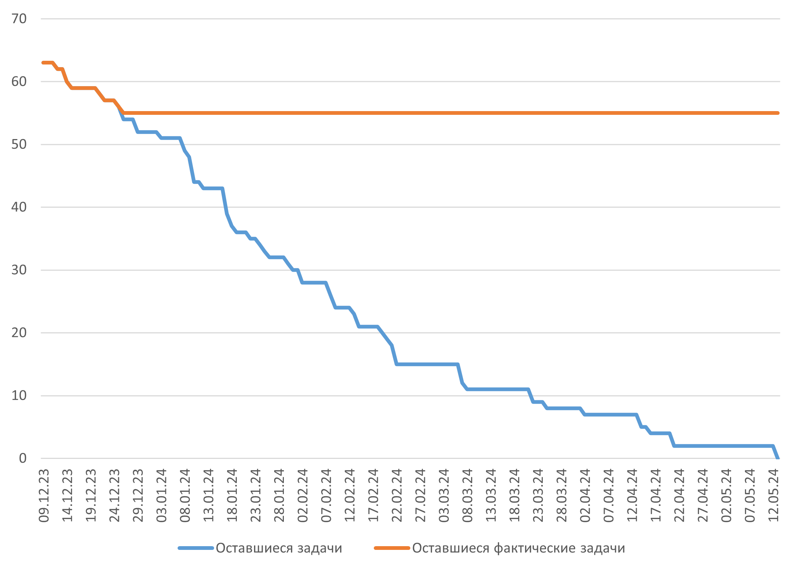

# [Заключение]{custom-style="UnnumberedHeadingOne"} {.unnumbered}

Выполненная работа ориентирована на создание системы для коммерческой компании, поэтому главным результатом данной работы является удовлетворенность заказчика. По итогу выполнения всех работ генеральным директором ООО "ГЭТ Э БЛАНКЕТ" Атаевой Сабиной Валерьевной подписан акт о внедрении системы описанной в данной работе в эксплуатацию внутри компании (см. приложение [-@sec:implementation-act]). Таким образом, можно говорить, что значимость этой работы в том, что разработанные в рамках выполнения выпускной квалификационной работы методы, программные средства и документация были и будут использоваться внутри компании. 

В ходе выполнения работы были выполнены следующие цели: 

1. Сформированы и формализованы требования к системе представленные в Техническом задании утвержденном компанией ООО "ГЭТ Э БЛАНКЕТ" (см. приложение [-@sec:TZ]).
1. Проведено проектирование разрабатываемой системы, формализована архитектура в соответствии с нотацией "С4 model", разработан прототип интерфейса технического обслуживания.
1. Разработаны компоненты программного продукта: Пользовательский интерфейс, Сервис аутентификации, Сервис управления автоматами.
1. Проведена тестовая эксплуатация демо пространства для тестирования пользовательского интерфейса на фокус группе, а также развернут полнофункциональное тестовое пространство. 

Для достижения данных целей был выполнен анализ предметной области, литературы и конкурирующих систем, что помогло определить требования и архитектурный облик системы. В рамках работы были проанализированы 22 научные работы, что позволило обосновывать выбор архитектурных и иных решений на основании научных исследований проведенных ранее, что в значительной степени повлияло на итоговый программный продукт.

В рамках установленных целей для уточнения первоначальных требований к системе был проведен функционально-стоимостной анализ. В рамках выполнения функционально-идеального моделирования получилась система, оценочная стоимость которой уменьшилась с 514 552 до 286 643 рублей (44%), однако стоит отметить, что функциональные возможности системы были упрощены, оценочная значимость (ценность) уменьшилась со 112 до 97 экспертных баллов (13%). Также для более точного определения качества системы полученной после функционально-идеального моделирования была разработана новая метрика "Квадратный логарифмический коэффициент отклонения значимости от стоимости", так как существующие метрики не отражают полной картины из-за того, что метрики основанные на усреднении показателей неустойчивы к значительным колебаниям показателей.

По итогу проведенного анализа стало возможно формирование требований к системе формализованное в Техническое задание. На основе требований и изучения научной литературы был выбран архитектурный стиль системы, определены компоненты системы, формализована архитектура контейнеров системы в нотации С4. 

Наличие формализованной архитектуры позволило оценить трудозатраты на реализацию проекта, что в свою очередь позволило разделить реализацию системы между членами команды разработки, для чего потребовалось определить средства и порядок коммуникации в команде, для формализации этого был определен План коммуникаций.

В рамках задач описанных в данной работе было проведено проектирование сервисов пользовательского интерфейса, аутентификации и управления автоматами и прототипирование технического интерфейса. Это позволило приступить к реализации сервисов, а далее к их тестированию. 

Результатом работы является разработанная система внедренная в бизнес-процессы компании, проходящая в данный момент тестирование в рамках лаборатории компании и тестирование на фокус-группах.

Разработанная система отличается тем, что спроектирована под уникальную бизнес-модель стартапа, это определяет ее уникальность. Данная система включает в себя как технологии используемые компаниями по шерингу (краткосрочной аренде) самокатов и велосипедов, таких как Whoosh и Urent [@urent;@whoosh], так и технологии систем управления вендингового бизнеса, что позволяет определять разработанную систему как уникальную, но это также определяет ее как нишевую, неспособную к лёгкой адоптации к иным бизнес-моделям. Это определяет ее дальнейшие пути развития: 

1. возможно внесение дополнительных сервисов для продажи вещей через автоматы;
1. возможна интеграция внешних систем, ведутся переговоры с компанией занимающейся арендой зонтов;
1. возможно дальнейшее развитие приложения пользовательского интерфейса для возможности компиляции в приложения для iOS и Android;
1. возможно внедрение дополнительного сбора информации о пользователях для отслеживания и проведения аналитики способов пользования системой.

# [Глоссарий]{custom-style="UnnumberedHeadingOne"} {.unnumbered}

|    |     |    |
|:---|:---:|:---|
| [ГОСТ]{custom-style="AbbreviationsTable"} | --- | Государственный стандарт |
| IoT | --- | Internet of things. Интернет вещей. Концепция сети передачи данных между физическими объектами («вещами»), оснащёнными встроенными средствами и технологиями для взаимодействия друг с другом или с внешней средой. |
| UML | --- | Unified Modeling Language. Стандартный язык графического представления проектов. |
| ООО | --- | Общество с ограниченной ответственностью. Форма коммерческой организации. |
| LDAP | --- | Lightweight Directory Access Protocol. Протокол прикладного уровня для доступа к службе каталогов. |
| NFC | --- | Near field communication. Технология беспроводной передачи данных малого радиуса действия. |
| SDK | --- | Software development kit. Комплект для разработки программного обеспечения. Набор инструментов для разработки программного обеспечения, объединённый в одном пакете, обычно содержит комплект необходимых библиотек, компилятор, отладчик, иногда — интегрированную среду разработки. |
| ФСА | --- | Функционально-стоимостной анализ. Метод системного исследования функций объекта с целью поиска баланса между себестоимостью и полезностью. |
| MVP | --- | Minimum viable product. Минимально жизнеспособный продукт.  Продукт, обладающий минимальными, но достаточными для удовлетворения первичных потребностей функциями первых потребителей. |
<!-- | Стандарт де-факто  | --- | "Неофициальный стандарт". Техническая или иная спецификация, изначально не являвшаяся стандартом, не разработанная как таковая и не принятая стандартизирующими организациями (например, ISO или ГОСТ), которая исторически начала широко использоваться и приниматься как стандарт. | -->

# [Список использованных источников]{custom-style="UnnumberedHeadingOne"} {.unnumbered}

# [ПРИЛОЖЕНИЕ\ А **Календарный план**]{custom-style="AppendixHeadingOne"} {#sec:calendar-plan label="А"}

Календарный план составлялся в системе управления ресурсов MS Project. Ниже представлен отчет сформированный 25 декабря 2023 года.

{#fig:diagcal1}

| Название | Начало | Окончание | % завершения |
|:---|:---|:---|:---|
| Формирование требований проекта  | Ср 11.10.23 | Пн 20.11.23 | 100% | 
| Проектирование разрабатываемой системы  | Вт 21.11.23 | Пт 15.12.23 | 100% | 
| Описание внутреннего распорядка разработки  | Пт 15.12.23 | Пт 29.12.23 | 73% |
| Разработка программного продукта  | Пн 25.12.23 | Чт 07.03.24 | 0% |
| Проведение опытной эксплуатации  | Пт 23.02.24 | Вс 21.04.24 | 0% |
| Полноценная эксплуатация в рамках бизнес-модели  | Пн 15.04.24 | Пн 13.05.24 | 0% |
| Сдача ВКР | Пн 13.05.24 | Пн 13.05.24 | 0% |

Table: Сроки выполнения основных работ {#tbl:workscal1}

Задачи представленные на рисунке [-@fig:diagcal1] и в таблице [-@tbl:workscal1] описаны более подробно в файле _Календарный план.mpp_, приложенном отдельно.

<!-- # [ПРИЛОЖЕНИЕ\ А **Финансовая модель проекта "Get a blanket"**]{custom-style="AppendixHeadingOne"} {#sec:fin-model label="A"} -->

<!-- ## [Ненумерованный подзаголовок приложения А]{custom-style="UnnumberedHeadingTwo"} {.unnumbered} -->

# [ПРИЛОЖЕНИЕ\ Б **Функционально-стоимостной анализ**]{custom-style="AppendixHeadingOne"} {#sec:FSA label="Б"}

<!-- %INCLUDE(ФСА.docx)% -->
Представлено в файле _ФСА.docx_.

<!-- TODO Приложения в приложениях, что с ними делать? -->
<!-- TODO главы из приложения в основном оглавлении -->

# [ПРИЛОЖЕНИЕ\ В **ФСА. Функциональная модель**]{custom-style="AppendixHeadingOne"} {#sec:FSA1 label="В"}

Представлено в файле _Функциональная модель.pdf_.

# [ПРИЛОЖЕНИЕ\ Г **ФСА. Структурная модель**]{custom-style="AppendixHeadingOne"} {#sec:FSA2 label="Г"}

Представлено в файле _Структурная модель.pdf_.

# [ПРИЛОЖЕНИЕ\ Д **ФСА. Функционально-структурная модель**]{custom-style="AppendixHeadingOne"} {#sec:FSA3 label="Д"}

Представлено в файле _Функционально-структурная модель.pdf_.

# [ПРИЛОЖЕНИЕ\ Е **ФСА. Оценка значимости функций**]{custom-style="AppendixHeadingOne"} {#sec:FSA4 label="Е"}

Представлено в файле _Оценка значимости функций.pdf_.

# [ПРИЛОЖЕНИЕ\ Ж **ФСА. Оценка стоимости реализации компонентов**]{custom-style="AppendixHeadingOne"} {#sec:FSA5 label="Ж"}

Представлено в файле _Оценка стоимости реализации компонентов.pdf_.

# [ПРИЛОЖЕНИЕ\ И **ФСА. Оценка оригинальной системы**]{custom-style="AppendixHeadingOne"} {#sec:FSA6 label="И"}

Представлено в файле _Оценка оригинальной системы.xlsx_.

# [ПРИЛОЖЕНИЕ\ К **ФСА. Оценка первой итерации улучшений**]{custom-style="AppendixHeadingOne"} {#sec:FSA7 label="К"}

Представлено в файле _Оценка первой итерации улучшений.xlsx_.

# [ПРИЛОЖЕНИЕ\ Л **ФСА. Оценка второй итерации улучшений**]{custom-style="AppendixHeadingOne"} {#sec:FSA8 label="Л"}

Представлено в файле _Оценка второй итерации улучшений.xlsx_.

# [ПРИЛОЖЕНИЕ\ М **Техническое задание**]{custom-style="AppendixHeadingOne"} {#sec:TZ label="М"}

<!-- %INCLUDE(ТЗ.docx)% -->
Представлено в файле _ТЗ.docx_.

# [ПРИЛОЖЕНИЕ\ Н **Финансовая модель на 5 лет**]{custom-style="AppendixHeadingOne"} {#sec:finmodel label="Н"}

Представлено в файле _Финансовая модель.xlsx_.

# [ПРИЛОЖЕНИЕ\ П **План коммуникации команды**]{custom-style="AppendixHeadingOne"} {#sec:communication-plan label="П"}

Представлено в файле _План коммуникаций.docx_.

# [ПРИЛОЖЕНИЕ\ Р **Диаграммы последовательности**]{custom-style="AppendixHeadingOne"} {#sec:diag-posl label="Р"}

{#fig:diag-posl1}

.png>){#fig:diag-posl2}

{#fig:diag-posl3}

{#fig:diag-posl4 height=24.5cm}

{#fig:diag-posl5 height=24.5cm}

# [ПРИЛОЖЕНИЕ\ С **Схема базы данных**]{custom-style="AppendixHeadingOne"} {#sec:DBScheme label="С"}

# [ПРИЛОЖЕНИЕ\ Т **Реестр рисков проекта**]{custom-style="AppendixHeadingOne"} {#sec:risk-register label="Т"}

Представлено в файле _Реестр рисков проекта.xlsx_.

# [ПРИЛОЖЕНИЕ\ У **Реагирование на риски проекта**]{custom-style="AppendixHeadingOne"} {#sec:risk-response label="У"}

Представлено в файле _Реагирование на риски.docx_.

# [ПРИЛОЖЕНИЕ\ Ф **Прототип интерфейса технического сервиса**]{custom-style="AppendixHeadingOne"} {#sec:figma-tech label="Ф"}

.png>)

# [ПРИЛОЖЕНИЕ\ Х **Отчет о пилотном внедрении**]{custom-style="AppendixHeadingOne"} {#sec:pilot-report label="Х"}

Представлено в файле _Отчет о пилотном внедрении.docx_.

# [ПРИЛОЖЕНИЕ\ Ц **Акт о внедрении**]{custom-style="AppendixHeadingOne"} {#sec:implementation-act label="Ц"}

Представлено в файле _Акт о внедрении.docx_.
