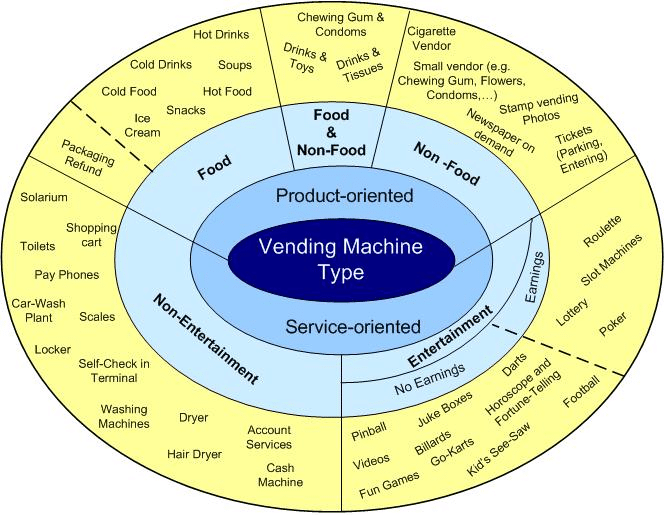

---
figureTitle: Рисунок
tableTitle: Таблица
tableEqns: true
titleDelim: "&nbsp;–"
link-citations: true
linkReferences: true
chapters: true
...

# [Аннотация]{custom-style="UnnumberedHeadingOneNoTOC"} {#referat .unnumbered}

Автор: студент НИУ ВШЭ Перминов Николай Александрович, Кафедра информационных технологий в бизнесе.

Тема работы: Разработка архитектуры и информационных подсистем системы краткосрочной аренды через вендинговые аппараты.

Вид выпускной квалификационной работы: проектная.

В связи с отсутствием программных продуктов позволяющих реализовать краткосрочную аренду пледов через вендинговые аппараты целью этой работы является разработка модулей системы краткосрочной аренды пледов через вендинговые, а именно модулей клиентского обслуживания, аутентификации, взаимодействия с вендинговыми автоматами. Обоснованием разработки является создание стартапа ООО "ГЭТ Э БЛАНКЕТ", реализующего сервис посуточной и почасовой аренды пледов. Система реализуися с использованием клиент-серверной архитектуры, а именно микросервисно-микроядерной архитектуры.

В первой главе рассматривается технологические возможности реализации, устройство вендингового автомата, существующие подходы и программные продукты для автоматизации процесса краткосрочной аренды, изучение программных, аппаратных и архитектурных возможностей для разработки продукта разработки, проведен функционально-стоимостной анализ с целью формирования требований к разрабатываемому программному продукту. Во второй главе описывается разработка архитектурного решения, выбор программных и аппаратных решений. В третьей главе указывается процесс разработки модулей, автоматизации развертывания и тестирования системы.

Работа состоит из %NCHAPTERS% глав, включает %NPAGES% стр. основного текста, %NFIGURES% рис., %NTABLES% табл., %NREFERENCES% источн. и %NAPPENDICES% прил.

# [Оглавление]{custom-style="UnnumberedHeadingOneNoTOC"} {.unnumbered}

%TOC%

# [Введение]{custom-style="UnnumberedHeadingOne"} {.unnumbered}

Экономика совместного потребления (шеринговая экономика) обеспечивается за счет технологий, с помощью которых люди могут обмениваться различными товарами и услугами. Ввиду бурного роста рынка шеринга и краткосрочной аренды [@sharing1billion], было проведено исследование рынка и перспектив продута. Таким образом, было определено, что наиболее перспективным будет направление развития краткосрочной аренды. Чтобы сделать данный бизнес рентабельным потребовалось сократить расходы на содержание точек раздачи, поэтому было принято решение использовать вендинговые аппараты.

Вендинговые аппараты получили широкое распространение ввиду нескольких факторов [@bplans-vending-machines;@biznes-na-vendingovih;@kak-zarabotat-na-vendingovyh]:

- возможность установки в местах, где невыгодна или невозможна установка классических точек продажи;
- низкие эксплуатационные расходы;
- малая стоимость установки, по сравнению с организацией классической точки продаж.

Таким образом, использование вендинговых аппаратов для реализации краткосрочной аренды стало наиболее выгодным решением, но использование вендинговых аппаратов сопряжено с трудностями того, что аренда не является типичной бизнес-моделью для вендинга и реализуется очень редко, чаще с использованием разработанных специально для этого моделей [@berizaryad]. Для контроля работы вендинговых аппаратов используются различные программно-аппаратные комплексы, относящиеся к типу систем управления мелкорозничной торговлей [@myVendTrack;@cantaloupe;@otiglobal]. Однако существующие программные и аппаратные системы не позволяют реализовать систему аренды через вендинговые аппараты. Это обуславливает целесообразность разработки системы, которая бы позволила реализовать краткосрочную аренду пледов через вендинговые аппараты.

Следовательно, объект исследования -- процесс краткосрочной аренды пледов через вендинговые аппараты, а именно организация автоматической выдача и приема пледов. Предмет исследования -- программная система обеспечения работы вендинговых аппаратов для сдачи пледов в краткосрочную аренду.

Программная система разрабатывается в интересах стартапа, сутью бизнес-модели которого является многоразовая сдача пледов. После каждого использования плед требуется изъять из автомата и отправить в химчистку. Поэтому в системе также требуется реализация модуля технического обслуживания с возможностью изъятия грязных пледов и выкладывания чистых. Система так же должна позволять производить комплекс действий для реализации краткосрочной аренды. Похожими системами обладают сервисы шеринга самокатов [@urent;@whoosh].

Исходя из этого был сделан вывод, что такая система слишком сложна для реализации одним человеком, таким образом, цель работы -- разработка архитектуры системы и ее модулей реализующих взаимодействие с клиентами, аутентификация клиентов через номер телефона, а также модуля взаимодействия системы с множеством вендинговых аппаратов.
<!-- , их аутентификация и подключение, а также организация автоматической интеграции и развертывания разрабатываемой системы.-->

Для выполнения работы и достижения обозначенной выше цели требуется решить следующие задачи: 

1. Формирование требований к разрабатываемому продукту:
    1. Формирование концепции продукта, а именно
    обоснование необходимости,
    анализ выгод от реализации,
    определение границ и ограничений реализации,
    определение пользователей системы,
    определение сценариев использования системы,
    определение требований пользователей к системе,
    анализ нормативных документов РФ.
    1. Определение функциональных требований.
    1. Определение нефункциональных требований.
    1. Формирование технического задания в соответствии с ГОСТ 19.201-78 [@gostTZ].

1. Проектирование разрабатываемой системы:
    1. Определение архитектуры разрабатываемой системы.
    1. Определение программных решений, используемых в ходе разработки системы.
    1. Формирование концепции визуального облика системы.
    1. Определение средств разработки и взаимодействия команды.

1. Разработка программного продукта:
    1. Разработка пользовательского интерфейса, модуля аутентификации клиентов, модуля управления автоматами.
    1. Формирование промежуточных выпусков программного продукта, а именно
    разработка алгоритмов автоматизированного развертывания,
    подготовка и настройка серверов для развертывания продукта,
    настройка вспомогательного программного обеспечения.
    1. Проведение тестирования программного продукта.
    1. Проведение документирования разработанных модулей, а именно
    написание руководства развертывания системы,
    описание функций API разработанных модулей в соответствии с нотацией OpenAPI.

1. Проведение опытной эксплуатации:
    1. Проведение опытной эксплуатации системы в рамках лаборатории, подготовка и установка модуля системы на вендинговый аппарат.
    1. Проведение опытной эксплуатации системы в рамках тестирования в парках с привлечением потенциальных клиентов.
    1. Устранение обнаруженных проблем.

Технологии, используемые в разработке, должны быть свободно распространяемые и не должны быть подвержены влиянию санкций. Временные ограничения обусловлены требованием заказчика ООО "ГЭТ Э БЛАНКЕТ", они не должны быть позже 31 марта 2024 года и должны соответствовать календарному плану проекта (см. приложение [-@sec:calendar-plan]).

<!-- Создание собственной модели автомата стоит слишком дорого и не оправдывает затраченных средств: вендинговый аппарат фабричной модели с ячейками стоит от 219 тысяч рублей в розницу [@vendElement], заказ одного собственного аппарата при небольшой партии составит не менее 500 тысяч рублей, при этом это сделает невозможным аренду или лизинг таких автоматов. Поэтому наиболее выгодным решением будет реализация системы, которая бы позволяла проводить операции аренды с использованием немодифицированных или маломодифицированных ячеечных автоматов. -->

На этапе разработки системы отсутствует доступ к вендинговому аппарату. Тестирование производится эмуляцией автомата, тестирование с использованием автомата производится на этапе проведения опытной эксплуатации.

<!-- В ходе выполнения задач ВКР должны быть получены следующие результаты: 

- разработаны и интегрированы в систему модули пользовательского интерфейса, аутентификации клиентов, управления автоматами;
- проведено тестирование программных модулей;
- реализованы автоматизированные интеграция и развертывание системы на серверах (сервере) заказчика;
- разработано руководство развертывания системы;
- взаимодеиствие модулей системы описано в соответствии с нотацией OpenAPI [@openAPISpec];
- проведено тестирование системы с использованием автомата, устранены критические неисправности выявленные в ходе тестирования. -->

<!-- Научная новизна выполненной работы отсутствует, так как результат не несет научного знания. Выполнение работы нацелено на разработку системы, которая позволит реализовать коммерческий проект.  -->

Практическая значимость состоит в возможности применения системы для создания коммерческого проекта, так как реализация описанной выше бизнес-модели невозможна с использованием существующих программных решений, так как без применения автоматизации выдачи и сдачи пледов слишком высоки расходы на содержание точек выдачи и сдачи.
<!-- Критерием успешности реализуемого проекта является применение компанией ООО "ГЭИ Э БЛАНКЕТ" разработанного решения, показателем успешности, таким образом, является акт о внедрении.  -->

# Степень изученности

Вендинговые аппараты стали популярны во второй половине 20 века, в СССР использовались автоматы по продаже напитков и газет [@soviet-vend]. На данный момент существует большое количество различных типов автоматов, как специализированных под конкретные задачи [@berizaryad], так и универсальные [@vendElement] (см. рисунок [-@fig:vend-types]).

{#fig:vend-types}

Таким образом, видно, что использование вендинговых технологий распространено на многие сферы, поэтому логично изучить научные работы на тему применения шеринговых и вендинговых технологий, а также применение технологий в сфере интернета вещей. В ходе анализа были обнаружены научные работы исследовавшие темы смежные к теме данной работы. В основном работы на данные темы связаны с финансированием и инвестированием в вендинговые технологии из чего можно сделать вывод, что программное обеспечение вендиговых аппаратов с научной точки зрения рассмотрено слабо, что делает данную работу более актуальной. Работ по использованию вендинга для аренды не было найдено в открытом доступе, но существует множество работ, описывающих использование шеринговых технологий. 

Таким образом, в ходе написания первой главы я буду опираться на работы: 

- в главе 1 на [@sharing1billion; @myVendTrack; @bplans-vending-machines; @biznes-na-vendingovih; @kak-zarabotat-na-vendingovyh; @urent; @whoosh; @invest-vend; @buisnes-vend; @laryok2; @vend-torg-russia; @sharing-control],

- в главе 2 на [@urent; @whoosh; @laryok2; @sharing-control; @recomend-vend; @model-alg-architecture; @instrumenty-architecture; @role-architecture; @microservice-monolithic-architecture; @sharing-control; @pmbok],

- в главе 3 на [@recomend-vend; @model-alg-architecture; @instrumenty-architecture; @role-architecture; @sharing-control; @plaksin; @development-authentication; @RESTful-API-Testing], а также документации программных и иных решений выбранных в главе 2.

В ходе исследования научных работ по смежным темам я обнаружил, что данные работы рассматривают предметную область либо с финансовой, либо с архитектурных точек зрения, но не рассматривают реализацию подобных систем, при этом рассматриваются либо шеринговые технологии в целом, либо классические продажи через вендинговые автоматы. Таким образом, научная новизна данной работы заключается в рассмотрении разработки программного продукта, реализующего систему шеринга через вендинговые аппараты.

# Краткое описание глав

В главе 1 должны быть описаны требования, которые предъявляются к системе. Так как система создается в интересах стартап проекта, следует сначала провести исследование рынка и финансовых перспектив стартапа. Это будет описано в первой части первой главы. 

Во второй части первой главы следует указать: 

- какие проблемы испытывает заказчик, для чего ему нужна программная система,
- границы реализуемой системы,
- пользователей системы,
- сценарии использования системы,
- ожидания пользователей к системе,
- анализ нормативных документов РФ.

Третья часть часть первой главы содержит описание формирования функциональных и нефункциональных требований.  

Итогом первой главы является техническое задание, утвержденное заказчиком ООО "ГЭИ Э БЛАНКЕТ", написанное в соответствии с ГОСТ 19.201-78 [@gostTZ].

В главе 2 будет описано формирование архитектуры проектируемой системы. 

В ходе проектирования будет проведен функционально-стоимостной анализ, который поможет определить наиболее оптимальную архитектуру системы. 

Вторая часть второй главы будет содержать информацию об исследовании разных паттернов архитектур и выборе структуры программной системы. На данном же этапе будет проведен анализ существующих программных решений, определение "стека" используемых технологий. 

Третья часть второй главы описывает формирование визуального облика системы, описание стиля проектирования системы, способы и средства моделирования разрабатываемой системы.

Четвертая часть второй главы описывает способы и правил взаимодействия и коммуникации команды при разработке проекта, определение средств разработки. Определение правил сборки релизов системы, объединения разных модулей в единую систему.

Итогом второй главы является описание архитектуры системы в нотации С4, диаграмма ландшафта системы, определённые средства разработки и взаимодействия команды описанные в правилах разработки команды.

В главе 3 будут описаны разработка, тестирование и автоматизация сборок релизов системы.

В данной главе будет описана разработка модулей пользовательского интерфейса, аутентификации клиентов через номер телефона, взаимодействия с множеством вендинговых аппаратов и программы для автомата. Также будет описана разработка скриптов автоматического развертывания сервисов модулей системы. 

Следующим этапом будет описано тестирование модулей с использованием автоматизированного тестирования, а также ручного тестирования в соответствии с критериями белого и чёрного ящика [@plaksin, с. 18-26], определение оценки количества ошибок в программе и оценки количества необходимых тестов [@plaksin, с. 71-83].

Далее будут описаны этапы внедрения, приемочного тестирования и опытной эксплуатации.

Итогом третьей главы является акт о внедрении программного продукта.
